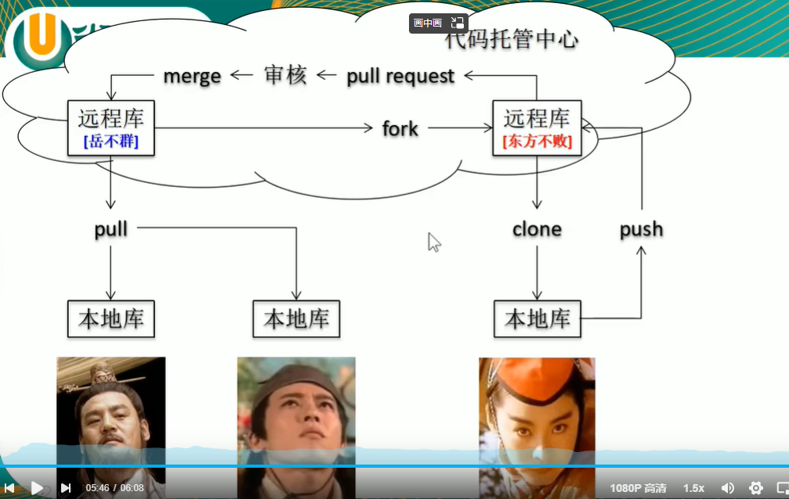
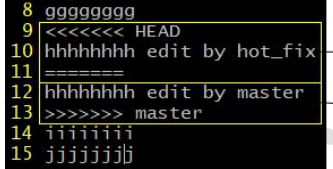

# GitHub&AndroidStudio

## AS使用GitHub初始化设置

* **step1**: GitHub设置token，用于在AS中添加GitHub账户，也可以密码登录
* **step2**: 本地使用gitbash在家目录（windows中的用户目录）执行`ssh-keygen -t rsa -C [邮箱]`生成的ssh公钥保存在GitHub，私钥在本机用于push的身份验证
* **step3**: GitHub中新建仓库（带有git ignore文件和README）
* **step4**: 项目目录中`git init`，在git bash中`git remote add [别名] [ssh仓库地址]`，如果不是ssh，用https协议，在命令行中可以呼出github的账号密码登录界面，windows系统会将凭证存储，所以用https只需要登陆一次，但如果没在gitbash中登录并生成凭证就直接在AS中push会失败。`git clone [别名]`
* **step5**: 将clone下来的文件夹内的git ignore等全部文件拖出替换



## 其他git初始化相关操作

1. *设置签名*：保存在用户目录下.gitconfig

   ```git
   git config --global user.name [用户名]
   git config --global user.email [用户邮箱]
   ```

2. 查看工作区、暂存区状态

   ```
   git status
   ```

3. 任何不在.gitignore下的新文件需要用`git add`来添加追踪（添加在暂存区），暂存区中的文件等待commit来同步，工作目录的任何变动使得和本地库不一致（working tree dirt）（例如修改文件和添加新文件），都需要重新添加到暂存区，git add存在的意义是可以撤销操作，对于修改文件可以跳过add直接commit，这样做会导致操作无法撤销

   ```
   git add [文件名]
   git commit -m "注释" [文件名]
   ```

4. 查看提交记录

   ```
   git log //空格下一页，b上一页，q退出
   git log --pretty=oneline
   git log --oneline //常用
   git reflog
   ```

5. 操作commit的版本进退

   ```
   git reset --hard [局部索引值，可以用git log --oneline查看]
   git reset --hard HEAD^^ //一个^代表后退一步
   git reset --hard HEAD~n //后退n步
   ```

6. 关于reset的不同模式

   > 更新顺序：工作区`git add`暂存区`git commit`本地库
   >
   > （commit的版本只增不减，后退不会删除版本）

   ```
   git reset --soft [] //移动本地库
   git reset --mixed [] //移动本地库和暂存区
   git reset --hard [] //移动三个
   ```

7. 利用reset删除添加到暂存区还未commit的文件

   ```
   git reset --hard HEAD
   ```

8. 比较文件

   ```
   git diff [文件名]
   git diff HEAD^ [文件名] //不带文件名表示列出所有文件的diff
   ```

## 分支

1. 查看所有分支

   ```
   git branch -v
   ```

2. 创建分支

   ```
   git branch [分支名]
   ```

3. 切换分支

   ```
   git checkout [分支名，可以用tab补全]
   ```

4. 合并分支

   > 从某个分支上的某个版本去创建新分支，就是在copy，拥有相同的历史版本，合并的意思就是同步两个分支的版本***非常重要，重点理解***

   ```
   git checkout [要添加其他分支的新版本的分支名] //切换分支
   git merge [另一个分支名]
   ```

5. 解决冲突

   合并相同的文件的相同行不一致，需要手动修改，后add文件并commit，注意，此时的commit不可以指定文件名，而是**直接`git commit -m "注释"`**很重要！

   

## 本地库和远程库

1. 查看远程库地址别名

   ```
   git remote -v
   ```

2. 创建别名

   ```
   git remote add [别名] [地址https/ssh]
   ```

3. 推送到远程库

   ```
   git push [别名] [分支名]
   ```

4. 克隆远程库

   > 该命令会在所在目录创建地址别名，并git init

   ```git
   git clone [地址https/ssh]
   ```

5. 从远程库拉取（更新本地库）

   ```
   git fetch [别名] [分支名] //将远程库的版本克隆
   git checkout [别名]/[分支名] //切换到该版本（用于查看内容，确定后再合并该版本到本地库）
   git checkout [分支名] //切换到本地的分支
   git merge [别名]/[分支名] //将远程版本合并到本地分支
   ```

6. pull = fetch + merge, 直接更新到远程库的某分支的最新版

7. 多人合作解决冲突

   如果另一个人已经push了他的版本，远程库处于最新版，此时你还处于上一个版本，在这种情况下GitHub不接受你的push，需要先进行拉取，更新到最新版才可以push，这时的拉取的版本可能与你现在的本地库的版本起冲突，git会让你进入到解决冲突的状态：

   * 手动解决冲突行
   * git add 文件
   * git commit -m "xxx" //不带文件名，该commit是解决冲突专用

8. 拉取请求

   对于跨团队提交代码

   * GitHub上fork别人的项目到自己的账号上，然后正常修改提交到远程库
   * 当想要把自己修改过的远程库同步到原远程库时，点击自己库里的pull request按钮
   * 原远程库拥有者会受到请求，审核后点同意merge