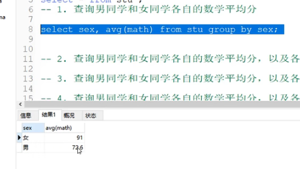
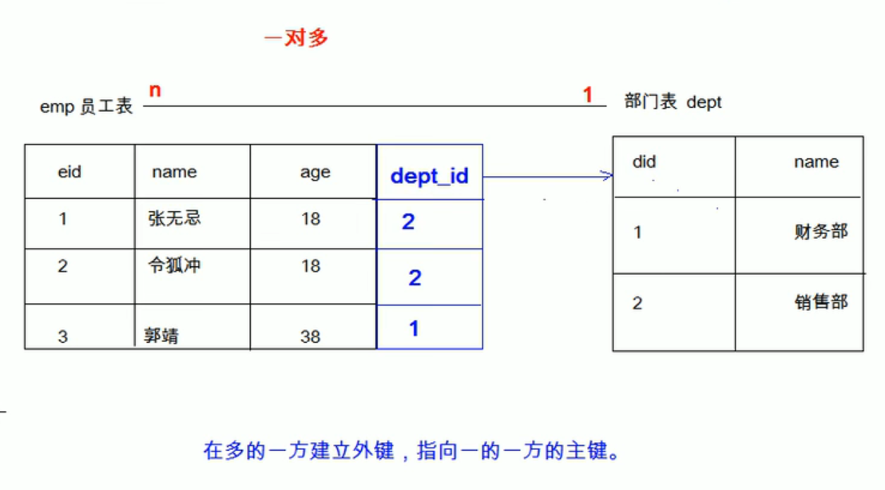
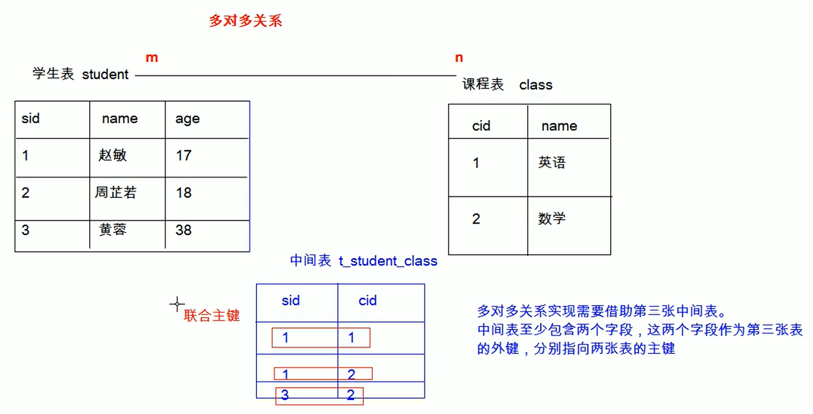
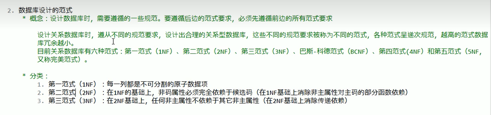
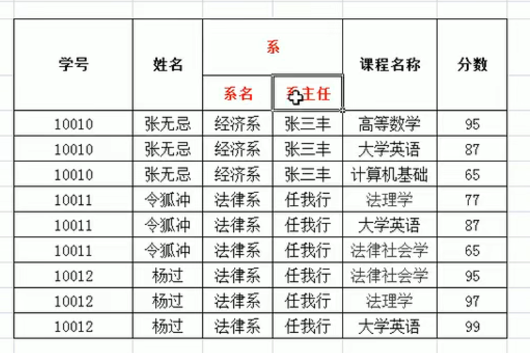
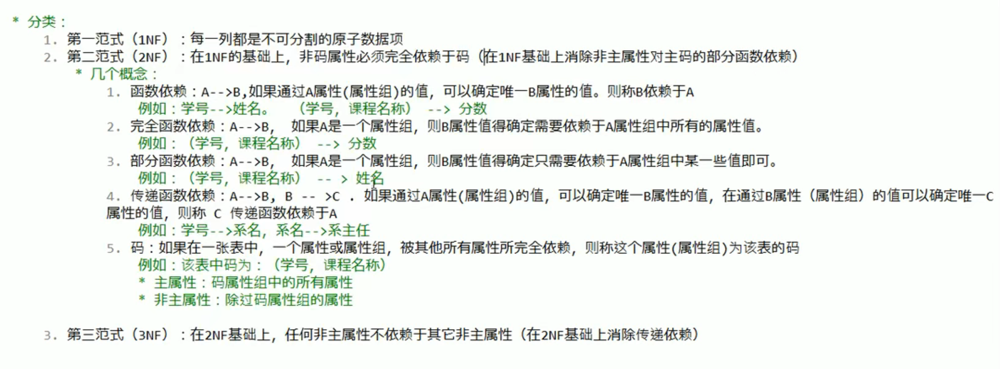
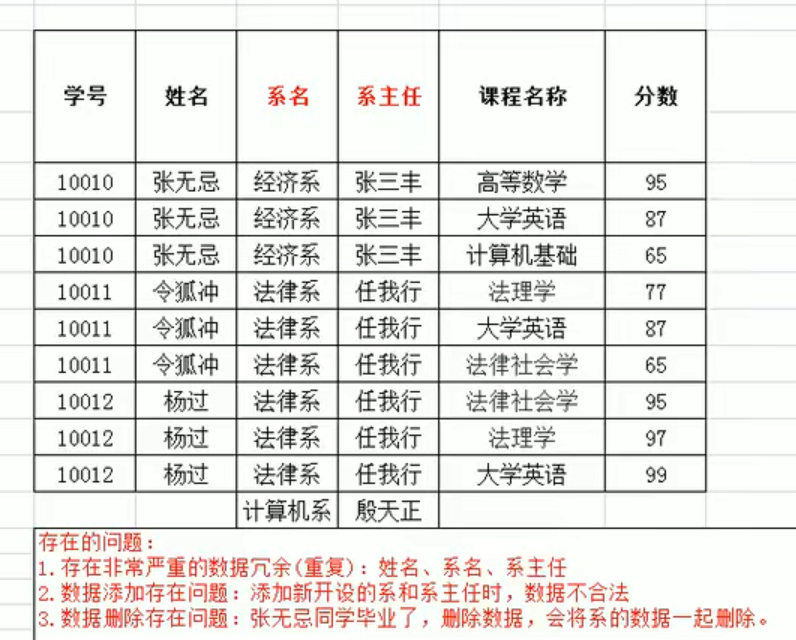
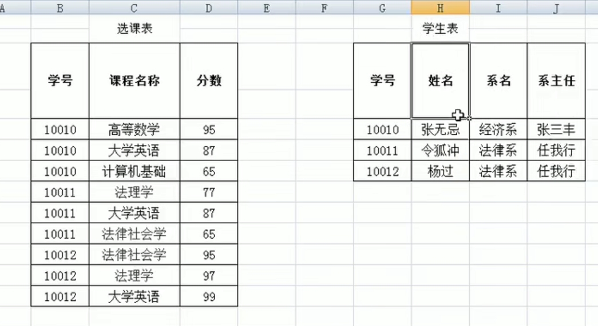
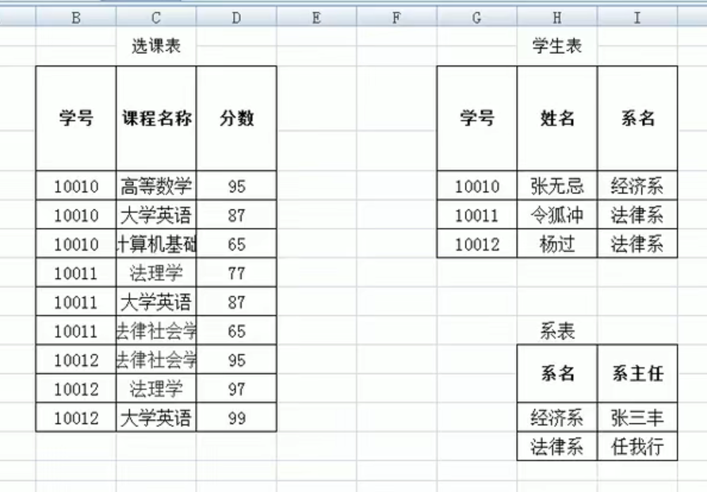

# SQL分类

1. DDL(data definition language)数据定义语言

   用于定义数据库对象，表，列

2. DML(data manipulation language)数据操作语言

   用于对表中的数据增删改

3. DQL(data query language)数据查询语言

   用于查询表中的数据

4. DCL(data control language)数据控制语言

   用于定义数据库的访问权限和安全级别，创建用户

## DDL

### 操作库

#### 创建create

```sql
CREATE DATABASE db1;
CREATE DATABASE IF NOT EXISTS db1; -- 如果不存在该数据库
CREATE DATABASE db1 CHARACTER SET gbk; -- 指定字符集
CREATE DATABASE IF NOT EXISTS db1 CHARACTER SET utf8; 
```

#### 查询retrieve

```sql
SHOW DATABASES; -- 查询所有数据库的名称
SHOW CREATE DATABASE db1; -- 查询指定的数据库的创建语句(可以看到数据库字符集)
```

#### 修改update

```sql
ALTER DATABASE db1 CHARACTER SET utf8; -- 修改数据库字符集
```

#### 删除delete

```sql
DROP DATABASE db1;
DROP DATABASE IF EXISTS db3;
```

#### 使用

```sql
SELECT DATABASE(); -- 查看当前使用数据库，括号是一部分
USE db1;
```

### 操作表

#### 创建create

```sql
CREATE TABLE tb1(
    id int,
    name varchar(20),
    age int,
    score double(5,2), -- 5=一共多少位，2=小数点后位数
    birthday date,
    insert_time timestamp
   );
CREATE TABLE tb2 LIKE tb1; -- 复制一份
```

#### 查询retrieve

```sql
SHOW TABLES; -- 查询一个数据库中的所有表
SHOW CREATE TABLE tb1; -- 查看表创建语句，包括字符集等
DESC tb1; -- 查询表结构
```

#### 修改update

```sql
ALTER TABLE tb1 RENAME TO tbone; -- 改名
ALTER TABLE tb1 CHARACTER SET utf8; -- 修改表字符集
ALTER TABLE tb1 ADD gender varchar(10); -- 添加列
ALTER TABLE tb1 CHANGE gender sex varchar(20); -- 修改列，名字和类型 
ALTER TABLE tb1 MODIFY gender int [not null]; -- 修改列，类型
ALTER TABLE tb1 DROP gender; -- 删除列
```

#### 删除delete

```sql
DROP TABLE tb1;
DROP TABLE IF EXISTS tb1;
```

## DML

### 增

```sql
INSERT INTO tb1(id,age,name) VALUES(1,21,`freddy`); -- 除了数字，其他都要用单引号括起来
INSERT INTO tb1 VALUES(所有值); -- 省略字段指定，则必须将所有字段给值
```

DQL:查询表中内容：select * from tb1;

### 删

```sql
DELETE FROM tb1 [WHERE id=1]; -- 不加条件则一句一句全删
TRUNCATE TABLE tb1; -- 删除表再创建一个空的出来相当于删除所有记录而不一句一句执行
```

### 改

```sql
UPDATE tb1 SET id=1, age=21 [WHERE id=2]; -- 不加条件，修改所有
```

## DQL

语法：

```
SELECT 
	字段列表
FROM
	表名列表
WHERE
	条件列表
GROUP BY
	分组字段
HAVING
	分组之后的条件
ORDER BY
	排序
LIMIT
	分页限定
```

### 基础查询

```sql
SELECT * FROM student;
SELECT name,age FROM student;
SELECT DISTINCT address FROM student; -- 去除重复结果，比如结果是合肥，重庆，合肥，芜湖，南京，操作后只有合肥，重庆，芜湖，南京
SELECT name,math,english,math + english FROM student; -- 计算和，当加数有一个为null时，结果为null
SELECT name,math,english,math + IFNULL(english, 0) FROM student; -- 当english值为null时用0替代
SELECT name,math,english,math + IFNULL(english, 0) AS 总分 FROM student; -- 起别名,可以把as替换成一个空格，适用于任何列名之后，结果中该列列名用别名显示
```

### 条件查询

```sql
SELECT * FROM student WHERE chinese = 89;
SELECT * FROM student WHERE chinese != 89;
SELECT * FROM student WHERE chinese>=60 AND chinese <=80;
SELECT * FROM student WHERE chinese BETWEEN 60 AND 80;
SELECT * FROM student WHERE chinese=55 OR chinese = 75 OR english=98;
SELECT * FROM student WHERE chinese IN (55, 75, 22) OR english=98; -- 括号里写符合条件的值
SELECT * FROM student WHERE math IS NULL;
SELECT * FROM student WHERE math IS NOT NULL;

-- LIKE 模糊查询 _下划线占1位，%占任意位
SELECT * FROM student WHERE NAME LIKE '赵%'; -- 百分号表示任意多个字符
SELECT * FROM student WHERE NAME LIKE '_平_'; -- 下划线表示任意单个字符
```

### 排序查询

```sql
SELECT * FROM student ORDER BY math; -- 默认升序
SELECT * FROM student ORDER BY math ASC;
SELECT * FROM student ORDER BY math DESC; -- 按照数学降序
SELECT * FROM student ORDER BY math DESC, english DESC; -- 成绩一样的按照英语降序排。第二条件只在第一条件相同时才应用
```

### 聚合函数

统计某一列数据，例如最高分选总分计算，数学的平均分选数学分计算

count：计算几行（选的那列不应该有空）

max：计算最大值

min：计算最小值

sum：计算和

avg：计算平均值

```sql
SELECT COUNT(math) FROM student; -- 聚合函数不计算null值，如果8行数据有一个有null，结果得7，一般选择非空列运算，可以写*号，count(*)，这样一定能统计出总共几行
SELECT MIN(IFNULL(math,0)) FROM student; -- 聚合函数忽略null
SELECT MAX(chinese) FROM student;
SELECT MIN(chinese) FROM student;
```

### 分组查询

聚合函数默认将==一整列==数据拿来算，分组会将该列按照另一个字段（性别）的不同值（男，女）来分成对应的不同组（男生一列，女生一列)，再分别对这些组聚合计算

**使用**`GROUP BY`**时，查询的字段只能为分组字段和聚合函数，其他无意义**



```sql
SELECT gender, AVG(math), COUNT(id) FROM student GROUP BY gender;
SELECT gender, AVG(math), COUNT(id) FROM student WHERE math>70 GROUP BY gender; -- where筛选哪些字段参与分组，表达式不可以是聚合
SELECT gender, AVG(math), COUNT(id) FROM student WHERE math>=70 GROUP BY gender HAVING COUNT(id)>2; -- having在分组结束之后过滤，如果数量不到2则不出现
SELECT gender, AVG(math), COUNT(id) AS 人数 FROM student WHERE math>=70 GROUP BY gender HAVING 人数>2; -- AS起别名，表达式可以写聚合
```

因为where在分组前执行聚合还没到执行的时候，所以不可以聚合，having在分组结束后执行，可以用聚合

### 分页查询

limit是mysql专用的

```sql
SELECT * FROM student LIMIT 0,3; -- 0是索引开始，3是每页显示3条
SELECT * FROM student LIMIT 0,3; -- 每页显示3条数据，查询第1页数据
SELECT * FROM student LIMIT 3,3; -- 每页显示3条数据，查询第2页数据
SELECT * FROM student LIMIT 6,3; -- 每页显示3条数据，查询第3页数据
-- 开始索引=（页码-1）*每页条数
```

## 约束

### 非空约束NOT NULL

```sql
CREATE TABLE stu(
    id INT,
    NAME VARCHAR(20) NOT NULL
);
ALTER TABLE stu MODIFY gender int [NOT NULL]; -- 写/不屑=删除/添加约束
```

### 唯一约束UNIQUE

```sql
CREATE TABLE stu1(
    id INT,
    phone_number VARCHAR(20) UNIQUE -- 该列的值不可重复，null也只可以有一个
);
ALTER TABLE stu1 DROP INDEX phone_number; --删除约束，添加用modify
```

### 主键约束：PRIMARY KEY 非空+唯一

```sql
CREATE TABLE stu2(
    id INT PRIMARY KEY,
    hobby VARCHAR(20)
);
--删除主键，添加用modify
ALTER TABLE stu2 DROP PRIMARY KEY;
```

### 自动增长 AUTO_INCREMENT

该列应该是数值类型

```sql
CREATE TABLE stu2(
    id INT PRIMARY KEY AUTO_INCREMENT, -- 一般与主键一起使用
    hobby VARCHAR(20)
);
INSERT INTO stu2 VALUES(NULL,'ccds');
INSERT INTO stu2 VALUES(NULL,'ccsc');
INSERT INTO stu2 VALUES(19,'cfcc');
INSERT INTO stu2 VALUES(NULL,'cccc'); -- 根据上一条id+1
--删除、增加自动增长
ALTER TABLE stu2 MODIFY id INT [AUTO_INCREMENT];
```

### 外键约束

==主表==中的某列被==从表==中的外键字段（外键字段也是一列，而外键名是外键名）指向，于是该列无法删除，外键不可以添加该列中不存在的值

```sql
CREATE TABLE department(
    id INT PRIMARY KEY AUTO_INCREMENT,
    dep_name VARCHAR(20),
    dep_location VARCHAR(20)
);-- 主表

CREATE TABLE employee( -- 从表
    id INT PRIMARY KEY AUTO_INCREMENT,
    `name` VARCHAR(20),
    age INT,
    dep_id INT,
    CONSTRAINT emp_dept_fk FOREIGN KEY (dep_id) REFERENCES department(id)
); -- constraint 外键名称 foreign key (从表列名) references 主表名(主表列名)
-- 主键所在的表就是主表（父表），外键所在的表就是从表（子表）。
-- 允许在外键中出现空值null。也就是说，只要外键的每个非空值出现在指定的主键中，这个外键的内容就是正确的。一个表可以有一个或多个外键，外键可以为空值，若不为空值，则每一个外键的值必须等于主表中主键的某个值。
-- 删除外键
ALTER TABLE employee DROP FOREIGN KEY emp_dept_fk; -- drop froeign key 外键名
-- 添加外键
ALTER TABLE employee ADD CONSTRAINT emp_dept_fk FOREIGN KEY (dep_id) REFERENCES department(id);
-- 设置级联更新，正常情况下修改主表的列的内容，从表中的外键列不会自动更新。
ALTER TABLE employee ADD CONSTRAINT emp_dept_fk FOREIGN KEY (dep_id) REFERENCES department(id) ON UPDATE CASCADE;
-- 设置级联删除，删除主表列，从表关联的对应外键也会删除
ALTER TABLE employee ADD CONSTRAINT emp_dept_fk FOREIGN KEY (dep_id) REFERENCES department(id) ON DELETE CASCADE;
```

## 多表

### 多表查询的形式

1对1，例如一个人对应一个身份证，该关系很少存在实际项目中

#### 1对n

一个部门对应多个员工



```sql
 CREATE TABLE tab_category(
    cid INT PRIMARY KEY AUTO_INCREMENT,
    cnmae VARCHAR(100) NOT NULL UNIQUE
 );
 CREATE TABLE tab_route(
    rid INT PRIMARY KEY AUTO_INCREMENT,
    rname VARCHAR(10) NOT NULL UNIQUE,
    price DOUBLE,
    cid INT,
    FOREIGN KEY (cid) REFERENCES tab_category(cid) -- 外键名称省略，自动分配
 ); -- 使用多的一方的外键指向一的一方的主键
```

#### n对n

多个学生选多门课程



```sql
 CREATE TABLE tab_user(
    uid INT PRIMARY KEY AUTO_INCREMENT,
    username VARCHAR(100) UNIQUE NOT NULL,
    `password` VARCHAR(30) NOT NULL,
    `name` VARCHAR(100),
    birthday DATE,
    sex CHAR(1) DEFAULT '男',
    telephone VARCHAR(11),
    email VARCHAR(100)
 );
 CREATE TABLE tab_favorite( -- 多对多用中间表
    rid INT,
     uid INT,
    `date` DATETIME,
    PRIMARY KEY(rid,uid),
    FOREIGN KEY(rid) REFERENCES tab_route(rid),
    FOREIGN KEY(uid) REFERENCES tab_user(uid)
 );
```


### 多表查询的分类

#### 内连接查询：两表交集

```sql
-- 隐式内连接：使用where条件消除无用数据
SELECT t1.name, t1.gender, t2.name
FROM emp t1, dept t2 -- 起别名
WHERE t1.'dept_id' = t2.'id';
-- 显示内连接：
SELECT * FROM emp [INNER] JOIN dept ON emp.'dept_id' = dept.'id';
SELECT 字段列表 FROM 表1 INNNER JOIN 表2 ON 条件;
```

#### 外连接查询：左(右)表所有数据+交集

```sql
左外连接
select * from tb1 left [outer] join tb2 on 条件
右外连接
select * from tb1 right [outer] join tb2 on 条件
```

#### 子查询：嵌套查询

```sql
子查询的结果集是单行单列
select * from emp where emp.`salary` = (select max(salay) from emp);
select * from emp where emp.`salary` < (select avg(salary) from emp);
多行单列
select * from emp where dept_id in (select id from dept where `name`='财务部' or `name`='市场部');
多行多列,作为新表用
select * from dept t1, (select * from emp where emp.`join`_date` > '2011-11-11') t2
where t1.id = t2.dept_id;
```

## 事务

```sql
update account set balance = 1000;
start transaction;
update account set balance = balance - 500 where name = '张三';
update account set balance = balance + 500 where name = '李四';
commit;
```

## DCL

```sql
-- 管理用户
create user '用户名'@'主机名' identified by '密码';
-- 删除用户
drop user '用户名'@'主机名';
-- 修改用---户密码
update user set password = password('新密码') where user = '用户名';
set password for '用户名'@'主机名' = password('新密码');
--主机名为%时表示任意主机
-- 无验证登录
cmd -> net stop mysql -- 管理员身份
mysqld --skip-grant-tables
-- 查询用户
use mysql;
select * from user;
-- 权限管理
show grants for '用户名'@'主机名';
grant 权限列表 on 数据库.表 to '用户名'@'主机名';
grant all on *.* to 'zhang'@'localhost';
-- 撤销权限
revoke 权限列表 on 数据库.表 from '用户名'@'主机名';
```

## 数据库设计范式



### 第一范式

只要是用sql写的，自然符合第一范式，因为sql语言不支持写出复合列



先理解范式中提到的几个概念：





### 第二范式

表中的问题：学号+课程名称是码， 分数完全依赖码，而姓名、系名、系主任 只部份依赖于学号，按照第二范式修改后的表为：



### 第三范式

按照第二范式分表后，解决了数据冗余，还存在2、3两个问题

在学生表中，学号是码，系名完全依赖于学号，系主任（非主属性）完全依赖于系名（非主属性）且传递依赖于学号，消除改依赖后如下：



