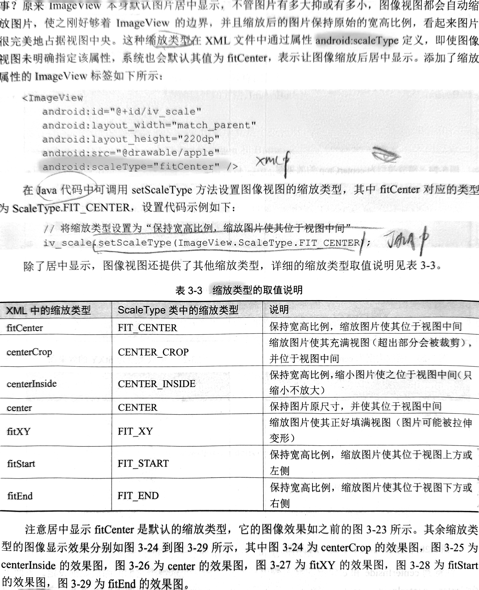

### 2.2.3 配置文件AndroidManifest.xml

```xml
<?xml version="1.0" encoding="utf-8"?>
<!--根节点指定命名空间使AS自动检查各节点属性名称是否合法-->
<manifest xmlns:android="http://schemas.android.com/apk/res/android"
    package="com.example.myapplication">

    <application
        android:allowBackup="true" //是否允许应用备份
        android:icon="@mipmap/ic_launcher" //屏幕上显示的启动图标
        android:label="@string/app_name" //屏幕上显示的应用名称
        android:roundIcon="@mipmap/ic_launcher_round" //圆角图标
        android:supportsRtl="true" //是否支持阿拉伯语/波斯语这种从右到左的文字排列顺序
        android:theme="@style/Theme.Demo_java"> // 应用的显示风格
        <activity
            android:name=".MainActivity" //默认主页
            android:exported="true">
            <intent-filter>
                <action android:name="android.intent.action.MAIN" /> //该action指定该页面为入口页面

                <category android:name="android.intent.category.LAUNCHER" /> //决定是否在手机屏幕上显示App图标
            </intent-filter>
        </activity>
    </application>

</manifest>
```

* res/layout目录下放置的XML文件默认为竖屏规格，在res下新建layout-land目录用于存放横屏规格的XML文件，在该目录中创建与原XML同名的文件，从而让系统在切换横竖屏时自动选择对应的布局

```java
tv_hello.setText(R.string.hello) //设置文字资源而非硬编码
```

* ScrollView滚动视图下方只能有一个子布局节点，当滚动视图实际内容不够，又想让其充满屏幕，添加一下属性

```xml
android:layout_height="match_parent"
andorid:fillViewPort="true"
```

* String.format

```java
String desc = String.format("%s您点击了按钮:%s", DataUtil.getNowTime(), ((Button)v).getText());
```

* 设置多个按钮监听的规范写法（凡是View派生来的控件都可以注册点击和长按监听器）

```java
// 从布局文件中获取名叫btn_click_public的按钮控件
Button btn_click_public = findViewById(R.id.btn_click_public);
// 设置点击监听器，一旦用户点击按钮，就触发监听器的onClick方法
btn_click_public.setOnClickListener(this);
@Override
public void onClick(View v) { // 点击事件的处理方法
    if (v.getId() == R.id.btn_click_public) { // 来自于按钮btn_click_public
    	String desc = String.format("%s 您点击了按钮：%s",
        DateUtil.getNowTime(), ((Button) v).getText());
        tv_result.setText(desc); // 设置文本视图的文本内容
    }
}
@Override
public boolean onLongClick(View v) { // 长按事件的处理方法
    if (v.getId() == R.id.btn_longclick_public) { // 来自于按钮btn_longclick_public
        String desc = String.format("%s 您长按了按钮：%s",
        DateUtil.getNowTime(), ((Button) v).getText());
        tv_result.setText(desc); // 设置文本视图的文本内容
    }
    return true;
}
```

### 图像显示

(fitCenter允许缩小和放大，centerInside只允许缩小，center不允许放大也不允许缩小)



### 使用Button在文字旁边放图标

```xml
<Button
    android:layout_width="wrap_content"
    andorid:layout_height="wrap_content"
    android:drawableTop="@drawable/ic_about" <!--该属性制定了图标-->
    android:drawablePadding="5dp"
    android:text="图标在上" />
```


