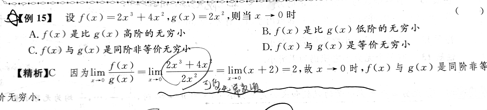
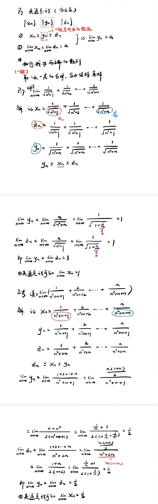

***库p35***

# 考点一：求函数的定义域与相同函数的判断

## 1. 求初等函数及分段函数的定义域

## 2. 求抽象函数的定义域

## 3. 相同函数的判断

# 考点二：求函数的表达式

## 1. 已知$f(x)$，求$f[g(x)]$的表达式

## 2. 已知$f[g(x)]$，求$f(x)$表达式

## 3. 已知$f[g(x)]$和$f(x)$，求$g(x)$的表达式

# 考点三：函数的性质

# 考点四：求已知函数的反函数 

# 考点五：无穷小的比较

[*库p58 题5*](# 9. 确定极限式中的参数)  这题很唬人：涉及抓大头，无穷小比较，极限式求参数，但其实这题是抓大头，不是无穷小，注意区分

*库p24 例15*

注意看，无穷小比较和抓大头比较的条件不一样，一个是$\frac{0}{0}$一个是$\frac{\infty}{\infty}$ 

# 考点六：求极限

求极限最原始的状态时将$x$趋向的$x_0$或无穷直接带入后面的式子，而题目考的往往是这最后一步之前的利用性质和公式、化简等方法

## 1. 有理化求极限（含根号）

*库p19 例7* 

## 2. 抓大头/÷最高项

*库p18 例6*

*库p19 例8*

## 3. 通分、约去零因式求极限

## 4. 等价无穷小替换、无穷小性质

*库p55 示例4*

## 5. 重要极限

***库p49 例43(2)*** 这题是虚假的指数函数，很坑

## 6. 分段函数在分段点处极限

## 7. 指数函数

## 8. 已知一个含极限的等式，求极限

## 9. 确定极限式中的参数

*库p47 例38* 

*库p48 题4*

[*库p58 题5* ](# 考点五：无穷小的比较)

## 10. 无穷小×有界

*库p49 例44*

# 考点七：数列极限的求解

## 夹逼准则

*库p21* 例12(典型)

*库p49 例45*

# 考点八：连续性

初等函数自带连续性

连续的定义是该点处有定义且等于该点处极限，该点处极限存在也就是该点处左右极限存在

# 考点九：判断间断点类型

# 考点十：零点定理

