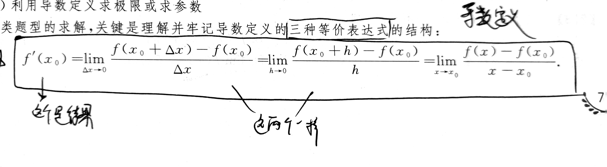
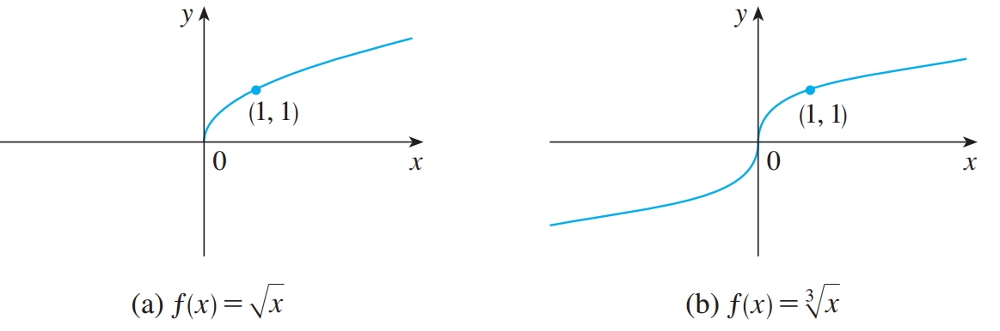
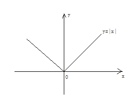

*库p77*

# 考点一：导数的定义和可导与连续的关系

## 导数定义的三种等价表达式和导数结果

此类题型的技巧就是直接拆开：*精 4B 59:45*

*库p78 例1 例2*

*库p79 真题1 真题5*

*精p30 例3*

*库p79 真题3* 这题暗示一个大坑：$f'(x_0) \neq f(x_0)$ 

## 分段函数在分段点处可导，求参求导（连续定义+导数定义）

*库p79 例6 真题2*

*库p86 示例1*

# 考点二：各类函数的导数

## 1. 初等函数的导数

*库p88 题2*

## 2. 隐函数的导数 

*库p88 题6(2)*

## 3. 对数求导法

蜜汁函数不能用复合函数求导法求

*库p87 示例4* 

*库p88 题9*

*库p88 题5*

# 考点三：导数的几何意义

切线方程和法线方程

## 导数与连续的关系

x=0处有切线x=0但不可导

不可导但连续

*库p88 题6*

*库p89 题3*

# 考点四：函数的微分

*库p84 例22*

*库p85 例23* $dy$要等于什么$dx$ 

# 考点五：高阶导数的计算

一般的是找规律，超大的呢，对于任何次数小于求导次数的普通项最后都会变成0，而其他项则看n阶导数公式*库p70* 

*库p70 例4*

*库p85 例25*

*库p86 例26*

*库p88 填空题3*