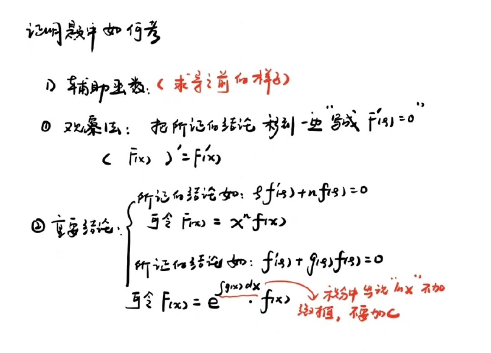

# 高数重点索引

## 第一章：函数、极限、连续

[考点：*库p35*](.\题型\第一章)

### 第一节：函数 

#### 定义域表示

​	集合：$\{x|x\in R且x\neq 0\}$

​	区间：$\ (-\infty,0)\cup(0,+\infty)$

#### 奇偶性

偶函数的图形关于 $y$ 轴对称

奇函数的图形关于原点对称

#### *基本初等函数

幂函数	*库p9*

指数函数	*库p10*

对数函数	*库p11*

**三角函数**	*库p12*

**反三角函数**	*库p13*

#### 初等函数

由基本初等函数和常数经过有限次四则运算和有限次复合运算所构成，但分段函数不属于初等函数。

初等函数自带连续属性

### 第二节：极限

#### 数列极限

数列极限可以看作函数极限中 $x$ 取正整数的子列的极限

#### 夹逼准则

*库p21* 例12(典型)

#### 函数极限

极限存在的充分必要条件：左右极限都存在且相等

在$x_0$处是否存在极限与$x_0$处是否有定义无关

函数极限的四则运算法则：即拆开后的两个极限都存在则可以拆开（指加减乘除）

#### 无穷大&无穷小

极限为0的量是无穷小量，无穷大不存在极限

无穷大和无穷小在不为0的情况下互为倒数

无穷小与有界函数相乘还是无穷小（常考）

#### 高低阶无穷小

*库p24 例15 p19*

#### *等价无穷小

*库p24* *精p13*

#### *两个重要极限

*库p26*

### 第三节：函数的连续性

#### 判断函数是否连续

利用连续的定义：$x_0$处有定义且该点处极限存在且二者相等

*精p22 例1 例2*

#### 函数的间断点

两种做法：找分母为0的点，找分段函数的分段点

第一类分段点：可去，跳跃

第二类分段点：无穷，震荡

*精p24 例4 例5 库p30*  

## 第二章：导数和微分

[考点：*库p77*](.\题型\第二章)

### 第一节：导数的概念

#### 导数的定义

两个定义公式*精p29 p34 t4*

一个题型技巧*精p30 p34 t3*

#### 可导与连续

注意：分段函数的导数不要直接将式子求导，而是用导数定义写

*精p31 例6 p32 例7 p35 t11*

### 第二节：函数的求导法

#### *基本初等函数的导数公式

*精p37*

#### 复合函数求导法

*精p45 t11*

#### 高阶导数  

*精p41 例10 例11*

#### 隐函数求导法

*精p41* 直接两边求导

*库p71*

#### 对数求导法

*精p42*
*库p72*

### 第三节：函数的微分

#### 微分的概念

就是dy=导数dx

可微一定可导，可导一定可微，一句话：没太大区别，主要是给导数外面套了一层d的壳子

### 第四节：洛必达法则和中值定理

#### 洛必达

*库p94~96*

通俗的说，就是分式上下可以同时求导来求极限

使用条件：$\frac{0}{0}$型和$\frac{\infty}{\infty}$型，使用后极限存在或者是无穷大

1. 对于$0\cdot\infty$型，(经常出现)，拿一个放到分母，这样转换成$\frac{\infty}{\frac{1}{0}}$即$\frac{\infty}{\infty}$型，或$\frac{0}{\frac{1}{\infty}}$即$\frac{0}{0}$型 *精p55 例5*

2. 倒代换:dagger:当式子里同时存在$x$和$\frac{1}{x}$时，将$x$设为$\frac{1}{t}$ *精p55 例4*

3. +1-1：对于$1^\infty$型，先利用对数求导法搞成$g(x)lnf(x)$, 然后对$ln$里面的+1-1：$g(x)ln[f(x)+1-1]$ 这样就凑成了等价无穷小替换：$ln(x-1)$~$x$ *精p56 例9* 

每一种未定式对应方法：*库p94~97*

#### 罗尔中值定理

*精6A 56:00*

#### 端点相等问题

*精p6B 05:00*

